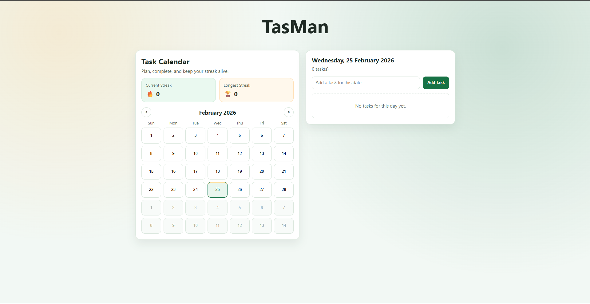
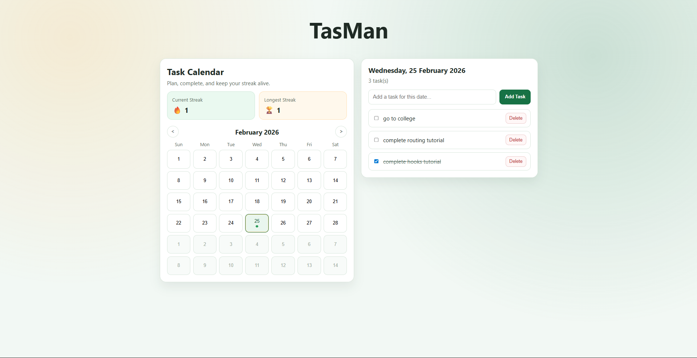

# 🗓️ Task Calendar – Streak Based Productivity App

A minimal and clean calendar-based task manager that helps users plan, complete tasks, and maintain daily streaks.
<hr>

## ✨ Features

<ul>
  <li>📅 Interactive monthly calendar view</li>
  <li>✅ Add & delete tasks by date</li>
  <li>🔥 Daily streak tracking</li>
  <li>🏆 Longest streak calculation</li>
  <li>💾 Persistent storage using LocalStorage</li>
  <li>🎨 Modern gradient UI design</li>
  <li>⚡ Fast and responsive</li>
</ul>
<hr>

## 🖼️ Preview

Add a screenshot in your root folder and use:



<hr>

## 🛠️ Tech Stack

<ul>
  <li>React</li>
  <li>JavaScript (ES6+)</li>
  <li>CSS (Custom styling + gradients)</li>
  <li>LocalStorage for persistence</li>
  <li>Vercel for deployment</li>
</ul>
<hr>

## 🧠 How It Works

<ul>
  <li>User selects a date from the calendar</li>
  <li>Tasks are stored against that date</li>
  <li>Completing tasks marks the day as active</li>
  <li>Streak logic checks consecutive completed days</li>
  <li>Data persists using browser LocalStorage</li>
</ul>
<hr>

## 📂 Project Structure

```
src/
 ├── components/
 ├── utils/
 ├── App.jsx
 ├── index.css
 └── main.jsx
```
<hr>

## 📌 Future Improvements

<ul>
  <li>User authentication</li>
  <li>Cloud database integration</li>
  <li>Dark/Light theme toggle</li>
  <li>Drag & drop tasks</li>
  <li>Mobile app version</li>
</ul>
<hr>

## 🙌 Why I Built This

I built this project to strengthen my understanding of:

<ul>
  <li>React state management</li>
  <li>Calendar logic & date manipulation</li>
  <li>Streak algorithms</li>
  <li>Production deployment workflow</li>
</ul>

<hr>

## 📄 License

This project is open-source and free to use.

## Author

-topperguy7
